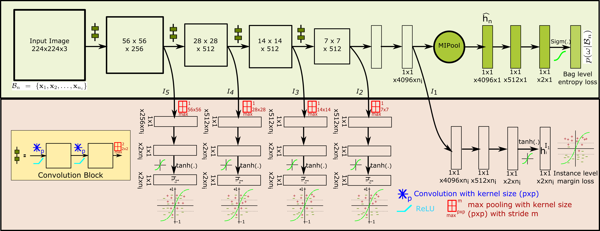

# Histopathology Whole Slide Classification with Multiple Instance Learning of Deep Convolutional Neural Networks

## Abstract
Histopathology whole slide images (WSI) are typically used for precise diagnostic reporting of tissue pathologies. Increase in number of histopathological examinations being performed, the development of vision based technologies for automating routine scan procedures is need of the hour. Convolutional neural networks (CNN) are popular used to learned visual feature representation in an end-to-end manner. In contrast to images used for vision inference, a typical WSI is in size 100,000x100,000x3 pixels. Also training a reliable classifier would require access to image patch specific labels. It require massive time to precisely search and label malignant region on such large size image by the pathologist. Clinically, a WSI is labeled malignant even when a trace evidence is found in it, while completely negative ones are only labeled as pathologically negative. This by property corresponds to the framework of multiple instance inference. In this paper we propose a new architecture and strategy of incorporating multiple instance learning (MIL) within a CNN. Each bag consist of small sized image patches, thereby reducing operational memory demand, with ability to learn using the label available only for the bag, thereby not being limited by lack of labels per patch of image. Furthermore this approach does not require any predetermined sampling of image patches from a WSI for classification. We evaluate performance of this method using the BreakHis, IUPHL and UCSB cancer datasets to achieve 93.06%, 96.63%, 95.83% accuracy respectively for WSI classification which improves performance by factors of 4.79%, 1.34%, 2.22% over their respective published prior art.

## Highlights
1. First, our proposed approach requires only bag level annotations (in contrast to many existing approaches using instance level annotations), reducing the cost of labelling. Given a limited time-span, a pathologist can annotate multiple such WSIs. 

2. Second, we propose to aggregate multiple instances in a bag, using a Multi-Instance pooling (MIPool) layer, which is placed at a high dimensional embedding space of the data, in contrast to label space which existing approaches. We hypothesize that this would provide a much better aggregation.

3. Third, to aid the training process of our deep CNN with MIPool layer (which sparsify the gradients), we propose to incorporate side-level supervision in the form of single instance losses at multiple locations. Further, the margin-level loss function is used to prevent noisy gradients, which single instance loss often provides.   

## Architecture

## Baselines

## Results

## Pre-requisites
You need to have following in order for this library to work as expected
1. Python >= 2.7
2. Torch V7
3. Numpy >= 1.14.0

