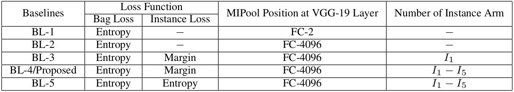
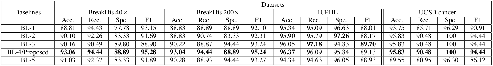

# Histopathology Whole Slide Classification with Multiple Instance Learning of Deep Convolutional Neural Networks

## Abstract
Histopathology whole slide images (WSI) are typically used for precise diagnostic reporting of tissue pathologies. Increase in number of histopathological examinations being performed, the development of vision based technologies for automating routine scan procedures is need of the hour. Convolutional neural networks (CNN) are popular used to learned visual feature representation in an end-to-end manner. In contrast to images used for vision inference, a typical WSI is in size 100,000x100,000x3 pixels. Also training a reliable classifier would require access to image patch specific labels. It require massive time to precisely search and label malignant region on such large size image by the pathologist. Clinically, a WSI is labeled malignant even when a trace evidence is found in it, while completely negative ones are only labeled as pathologically negative. This by property corresponds to the framework of multiple instance inference. In this paper we propose a new architecture and strategy of incorporating multiple instance learning (MIL) within a CNN. Each bag consist of small sized image patches, thereby reducing operational memory demand, with ability to learn using the label available only for the bag, thereby not being limited by lack of labels per patch of image. Furthermore this approach does not require any predetermined sampling of image patches from a WSI for classification. We evaluate performance of this method using the BreakHis, IUPHL and UCSB cancer datasets to achieve 93.06%, 96.63%, 95.83% accuracy respectively for WSI classification which improves performance by factors of 4.79%, 1.34%, 2.22% over their respective published prior art.

## Highlights
1. First, our proposed approach requires only bag level annotations (in contrast to many existing approaches using instance level annotations), reducing the cost of labelling. Given a limited time-span, a pathologist can annotate multiple such WSIs. 

2. Second, we propose to aggregate multiple instances in a bag, using a Multi-Instance pooling (MIPool) layer, which is placed at a high dimensional embedding space of the data, in contrast to label space which existing approaches. We hypothesize that this would provide a much better aggregation.

3. Third, to aid the training process of our deep CNN with MIPool layer (which sparsify the gradients), we propose to incorporate side-level supervision in the form of single instance losses at multiple locations. Further, the margin-level loss function is used to prevent noisy gradients, which single instance loss often provides.   

## Architecture

*An illustration of the deep convolutional neural network with multiple instance level semi-supervised models. Bag level representation is achieved by the strategy of instance features aggregation through feature level max-pooling layer (MIPool) at the feature embedding dimension of 4096. Multiple margin-based instance level loss is introduced at multiple levels of architecture as side level supervisions of the architecture. It aims to perform the instance level classification by inheriting the label from its corresponding bag. In this figure, the upper block comes to play during training and inference both of the time, whereas the lower block comes to play only during training time.*

## Baselines
#### Configuration of the different incremental baselines are introduced below. Here, FC-Dim defines Fully Connected (FC) Layer at feature dimension (Dim) with respect to VGG-19 layer. 

1. Code of these baselines are available here in these github repo.

#### Performance of different baselines are being tabulated here. Here, Acc., Rec., Spe. and F1-Score represent Accuracy, Recall, Specificity and F1-score repectively.

## Pre-requisites
You need to have following in order for this library to work as expected
1. Python >= 2.7
2. Torch V7
3. Numpy >= 1.14.0

## Training and evaluating our model
Execute the following command for deploying on your choice datasets:
- python mil_main.py

This is the proposed architecture. 

To further test the other baselines (baseline properties are mentioned in the above table), execute the following command:
- python bl_1.py (for Baseline-1)
- python bl_2.py (for Baseline-2)
- python bl_3.py (for Baseline-3)
- python bl_5.py (for Baseline-5)

## Code Author
1. [Kausik Das](https://github.com/KausikDas-10/)

## Help us to improve
Let us know if you face any issues. You are always welcome to report new issues and bugs and also suggest further improvements. And if you like our work hit that star button on top. Enjoy :)

## 
